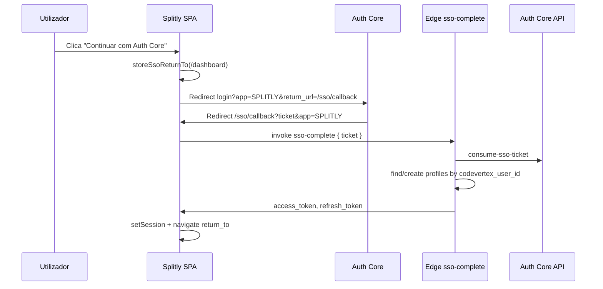

# Fase 2A — Auth Core SSO (Splitly)

Integração controlada por feature flag: login central CodeVertex + sessão Supabase local, sem remover auth local.

## Feature flag

| Variável | Valores | Efeito |
|----------|---------|--------|
| `VITE_AUTH_CORE_ENABLED` | `true` / `false` | `false` (default): UI e fluxo atuais (email/password). `true`: botões Auth Core + callback SSO. |

**Rollback imediato no Vercel:** definir `VITE_AUTH_CORE_ENABLED=false` e redeploy. O login local volta a ser o primário.

## Fluxo (flag `true`)



1. **Login:** `Auth.tsx` → `getAuthLoginUrl(returnTo)` → Auth Core.
2. **Callback:** `/sso/callback` → `sso-complete` → `supabase.auth.setSession`.
3. **Destino:** `sessionStorage` `splitly_sso_return_to` (sanitizado) ou `/dashboard`; convites de grupo usam `/invite/:token`.
4. **Logout:** `signOut()` local + redirect `getAuthLogoutUrl()` (Auth Core).

**Sem account linking por email:** utilizador local novo só por `profiles.codevertex_user_id`; contas locais antigas não são fundidas.

## Variáveis de ambiente

### Vercel (frontend)

| Variável | Obrigatória (flag true) |
|----------|-------------------------|
| `VITE_SUPABASE_URL` | Sim |
| `VITE_SUPABASE_ANON_KEY` | Sim |
| `VITE_AUTH_CORE_ENABLED` | `true` para testar |
| `VITE_APP_CODE` | `SPLITLY` |
| `VITE_AUTH_BASE_URL` | `https://auth.codevertex.cc` |
| `VITE_CODEVERTEX_SUPABASE_URL` | Referência (opcional no SPA; Edge usa secrets) |
| `VITE_CODEVERTEX_SUPABASE_ANON_KEY` | Idem |

Help/Legal/billing: mesmas da Fase 1 (`VITE_HELP_BASE_URL`, etc.).

### Supabase Splitly (Edge `sso-complete`)

| Secret | Descrição |
|--------|-----------|
| `SUPABASE_URL` | Auto |
| `SUPABASE_ANON_KEY` | Auto |
| `SUPABASE_SERVICE_ROLE_KEY` | Auto |
| `CODEVERTEX_SUPABASE_URL` | Projeto Auth Core |
| `CODEVERTEX_SUPABASE_ANON_KEY` | Anon Auth Core |

```bash
supabase secrets set CODEVERTEX_SUPABASE_URL=https://xxx.supabase.co
supabase secrets set CODEVERTEX_SUPABASE_ANON_KEY=eyJ...
supabase functions deploy sso-complete
```

## Allowlist no Auth Core

Registar URLs de callback e origem (produção + preview Vercel):

| Tipo | Exemplo |
|------|---------|
| SSO callback (`return_url`) | `https://splitly.vercel.app/sso/callback` |
| Preview | `https://<branch>-<team>.vercel.app/sso/callback` |
| Local | `http://127.0.0.1:3000/sso/callback` (porta Vite) |
| Pós-logout (`return_to`) | `https://splitly.vercel.app` (origin) |

App code: **`SPLITLY`**.

Rotas Auth Core usadas:

- `/auth/login?app=SPLITLY&return_url=...`
- `/auth/register?app=SPLITLY&return_url=...`
- `/auth/forgot-password?app=SPLITLY`
- `/logout?app=SPLITLY&return_to=...`

## Testar no Vercel

1. Migration `profiles.codevertex_user_id` aplicada no projeto Splitly.
2. Deploy Edge `sso-complete` + secrets `CODEVERTEX_*`.
3. Vercel: `VITE_AUTH_CORE_ENABLED=true` + URLs CodeVertex.
4. Auth Core: allowlist do domínio Vercel.
5. Abrir app → "Continuar com Auth Core" → login no Core → voltar a `/sso/callback` → dashboard.
6. Logout → deve passar pelo Core e regressar à origin.

**PoC manual (sem UI):** ver `docs/sso-complete-poc.md` e função `sso-complete-poc` (opcional).

## Ficheiros principais

| Área | Ficheiros |
|------|-----------|
| Flag + URLs | `src/lib/codevertexAuth.ts` |
| Return path | `src/lib/ssoReturnTo.ts` |
| Callback | `src/pages/SsoCallbackPage.tsx` |
| Rotas | `src/App.tsx` (`/sso/callback` público) |
| Login UI | `src/components/Auth.tsx` |
| Logout | `src/components/AppLayout.tsx` |
| Edge | `supabase/functions/sso-complete/` |

## Limitações

- Flag `false` em produção até validação completa.
- `sso-complete` com `verify_jwt = false` (ticket como credencial); reforçar segurança em fase posterior.
- Sessão via `generateLink` + `verifyOtp` (ver PoC).
- Login local mantido como fallback ("Usar e-mail e palavra-passe").

## Rollback

1. `VITE_AUTH_CORE_ENABLED=false` no Vercel → redeploy.
2. (Opcional) desativar allowlist de preview no Auth Core.
3. Edge `sso-complete` pode permanecer deployada; o frontend deixa de a invocar.

Nenhuma alteração a RLS, JWT custom, billing ou Help/Legal.
